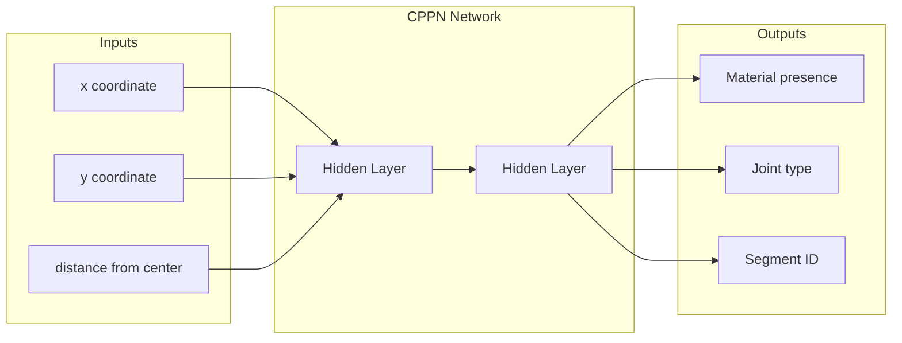
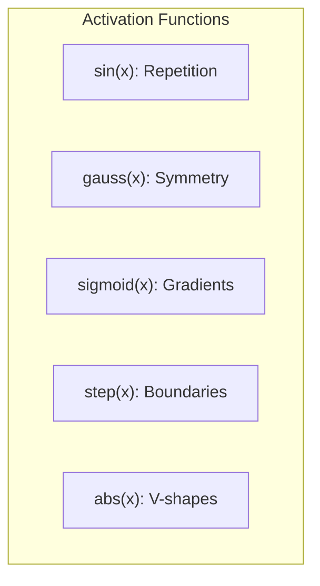
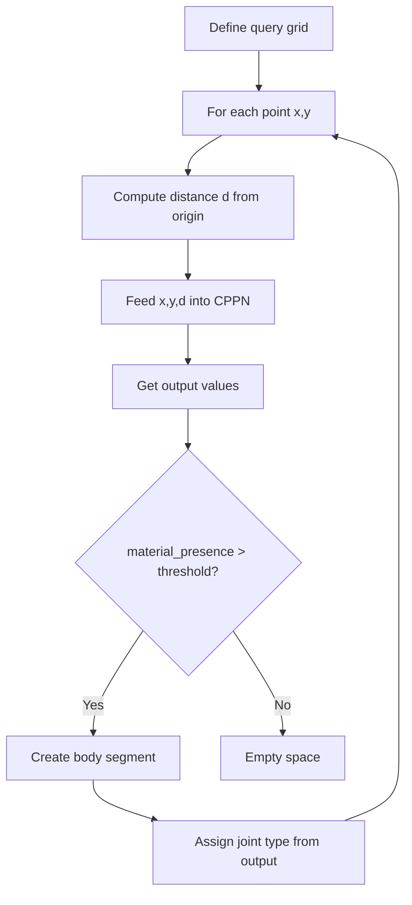
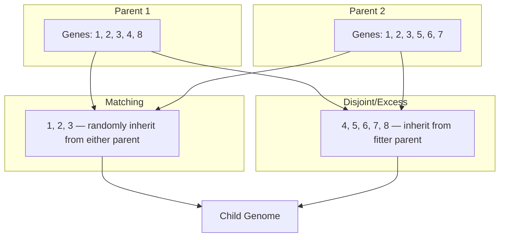
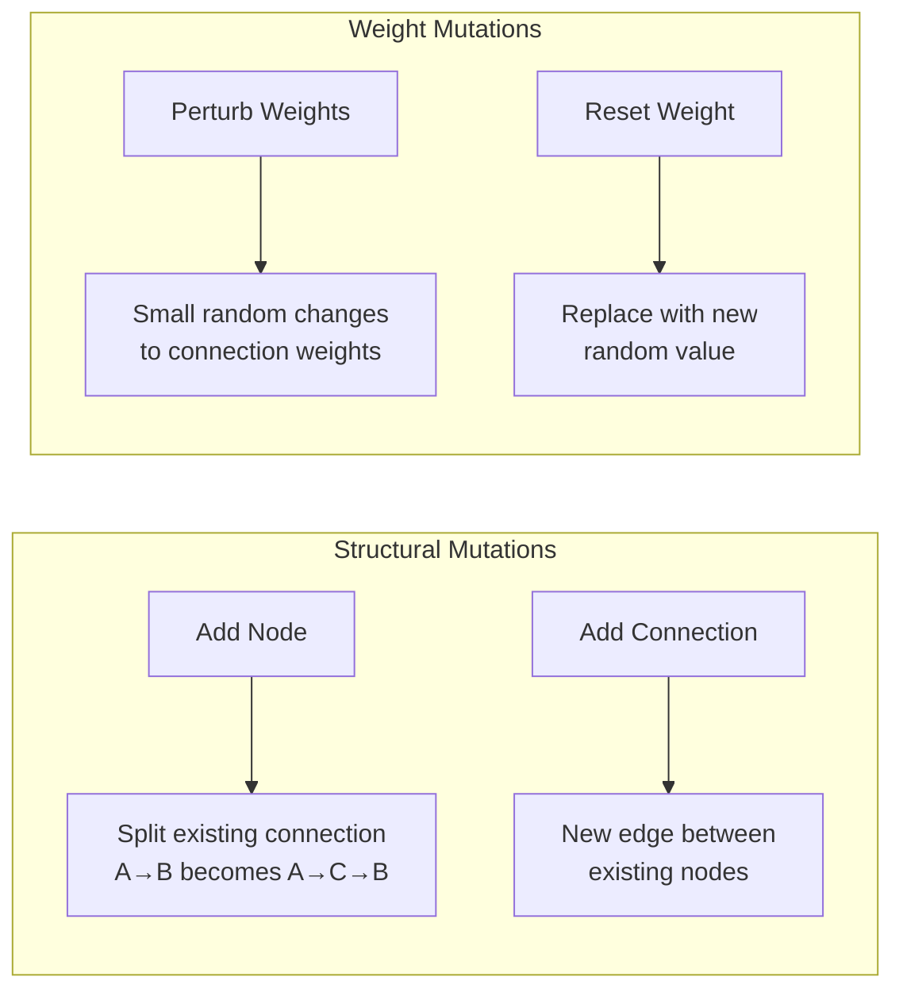
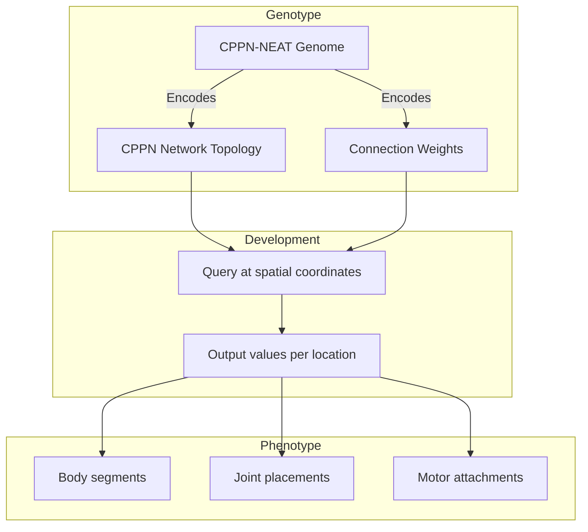
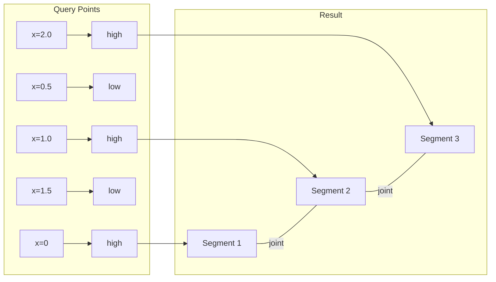

# CPPN-NEAT: Procedural Morphology Generation

Sunaba's creatures don't have hand-designed bodies. Instead, their morphologies are procedurally generated by **Compositional Pattern Producing Networks (CPPNs)**, evolved using **NeuroEvolution of Augmenting Topologies (NEAT)**.

## The Problem: Designing Bodies

How do you create diverse, functional creature morphologies without hand-designing each one?

Nature's solution is development — a genetic blueprint (genotype) unfolds into a physical body (phenotype) through growth processes. The same approach can work for artificial creatures.

## Compositional Pattern Producing Networks (CPPNs)

### What is a CPPN?

A CPPN is a neural network that generates patterns by taking spatial coordinates as input and outputting values that determine properties at those locations.



### Why CPPNs Work

CPPNs leverage **geometric regularities** found in natural organisms:

| Regularity | Activation Function | Effect |
|------------|---------------------|--------|
| Symmetry | Gaussian (distance) | Bilateral symmetry |
| Repetition | Sine | Repeating segments |
| Gradients | Linear | Smooth transitions |
| Sharp boundaries | Step | Distinct regions |

By combining these functions, CPPNs can produce:
- Bilaterally symmetric bodies
- Repeating limb segments
- Smooth body contours
- Distinct organs/regions

### Activation Functions

CPPNs use diverse activation functions, each contributing different geometric properties:



**Sine** — Creates repeating, periodic patterns (limb segments, stripes)

**Gaussian** — Creates radially symmetric patterns (eyes, body centers)

**Sigmoid** — Creates smooth gradients (density variations, tapers)

**Step** — Creates sharp boundaries (distinct body regions)

**Absolute value** — Creates V-shaped patterns (limb bifurcations)

### CPPN Query Process

To generate a creature body, we query the CPPN at many spatial coordinates:



## NEAT: NeuroEvolution of Augmenting Topologies

### The Challenge of Evolving Network Topology

Traditional neuroevolution fixes the network architecture and only evolves weights. But optimal topology varies by problem. NEAT solves this by evolving both topology and weights simultaneously.

### Historical Markings

NEAT's key innovation is **historical markings** — every gene (connection) receives a unique global ID when created:

```
Gene 1: Node A → Node B (innovation #1)
Gene 2: Node B → Node C (innovation #2)
Gene 3: Node A → Node C (innovation #3)  ← New connection
```

These markings enable meaningful crossover between networks with different topologies.

### Crossover with Historical Genes



### Speciation

NEAT protects innovation through **speciation**. New topological structures initially perform poorly but may lead to better solutions. By grouping similar genomes into species, NEAT prevents premature convergence.

Species distance:

```
δ = c₁(E/N) + c₂(D/N) + c₃·W̄
```

Where:
- E = excess genes
- D = disjoint genes
- W̄ = average weight difference
- N = normalizing factor (genome size)

### Mutation Operators



## CPPN-NEAT for Morphology

Combining CPPN and NEAT creates a powerful system for evolving creature bodies.

### The Genotype-Phenotype Mapping



### CPPN Outputs for Sunaba Creatures

| Output | Interpretation |
|--------|----------------|
| body_presence | Whether material exists at this point (threshold) |
| segment_id | Which body segment this belongs to |
| joint_type | 0=none, 1=revolute, 2=prismatic, 3=fixed |
| motor_strength | Maximum torque for motorized joints |
| limb_thickness | Radius of body at this point |

### Example: How a Limb Emerges

Consider a CPPN with a sine function in its hidden layer:

1. Query points along the x-axis
2. Sine function creates periodic output
3. High values → body present
4. Periodic high values → segmented limb
5. Joint outputs between segments → articulated limb



## In Sunaba

### Joint Types

Sunaba creatures can have three joint types:

**Revolute** — Rotation around a point (like an elbow)
- 1 degree of freedom
- Motor applies torque
- Used for walking, swimming

**Prismatic** — Linear sliding (like a piston)
- 1 degree of freedom
- Motor applies force
- Used for jumping, striking

**Fixed** — Rigid connection
- 0 degrees of freedom
- Structural support
- Used for body cores

### Morphology Constraints

To ensure physically viable creatures:

- Minimum body mass threshold
- Maximum aspect ratio
- Connectivity requirements (no floating parts)
- Joint limits to prevent self-intersection

### Evolved Morphology Examples

Evolution produces diverse body plans:

- **Worm-like**: Long chains of segments with revolute joints
- **Spider-like**: Central body with radiating limbs
- **Blob-like**: Compact bodies with few joints
- **Snake-like**: Undulating chains using prismatic joints

## Benefits of CPPN-NEAT

1. **Indirect encoding** — Small genomes produce complex bodies
2. **Geometric regularities** — Natural symmetry and repetition
3. **Evolvability** — Small mutations produce meaningful variations
4. **Open-ended** — Topology can grow without bound

## References

- Stanley, K.O. (2007). "Compositional Pattern Producing Networks: A Novel Abstraction of Development." *Genetic Programming and Evolvable Machines*.
- Stanley, K.O. & Miikkulainen, R. (2002). "Evolving Neural Networks through Augmenting Topologies." *Evolutionary Computation*.
- Cheney, N., MacCurdy, R., Clune, J., & Lipson, H. (2013). "Unshackling Evolution: Evolving Soft Robots with Multiple Materials and a Powerful Generative Encoding." *GECCO*.
- Clune, J., Stanley, K.O., Pennock, R.T., & Ofria, C. (2011). "On the Performance of Indirect Encoding Across the Continuum of Regularity." *IEEE TEVC*.
