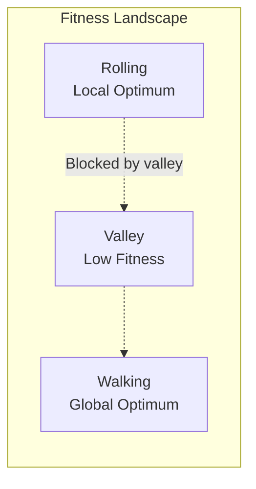
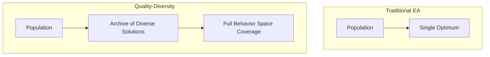
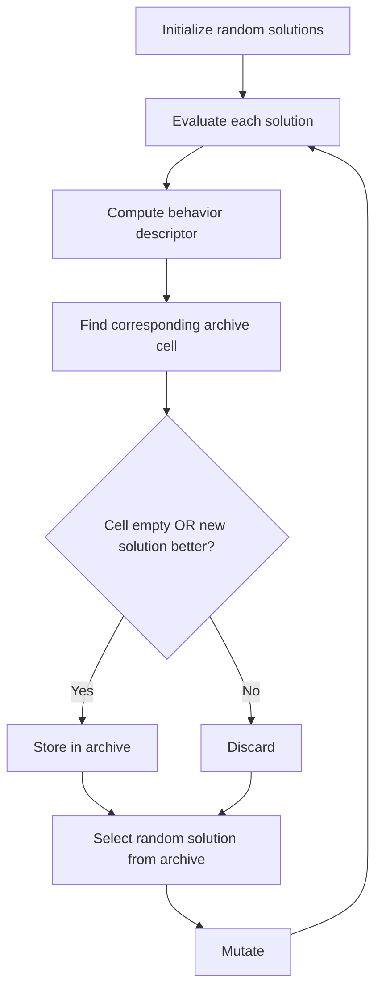
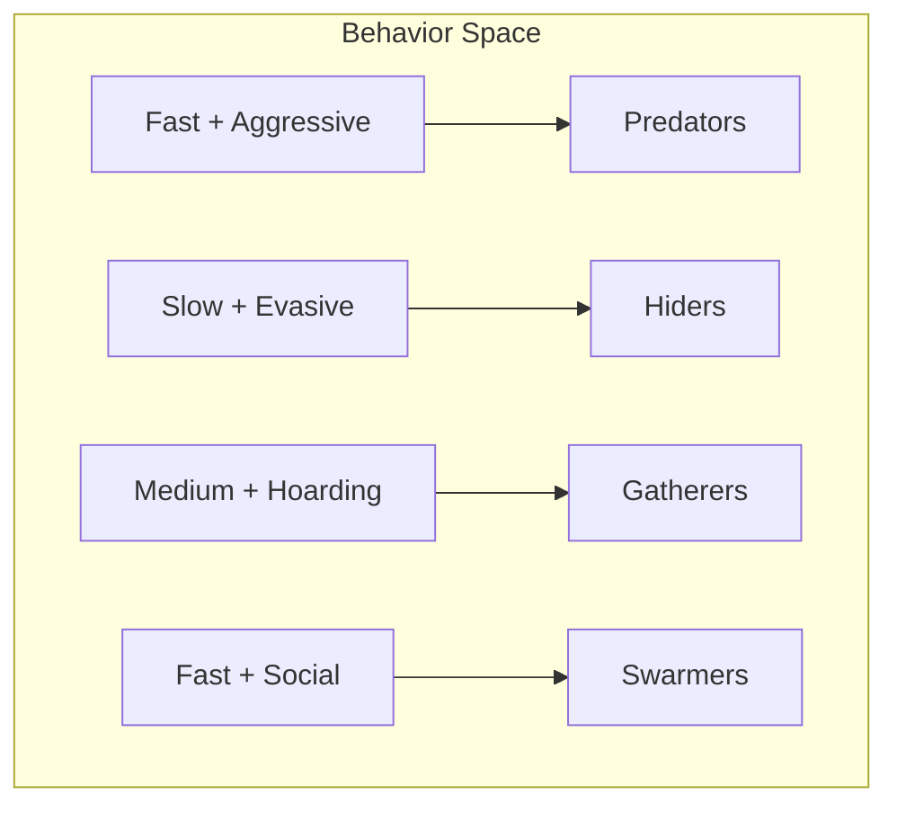

# MAP-Elites: Quality-Diversity Optimization

Traditional evolutionary algorithms optimize a single fitness function, converging toward a single "best" solution. **MAP-Elites** takes a different approach: it simultaneously discovers diverse, high-quality solutions across a space of behavioral characteristics.

## The Problem with Fitness-Only Optimization

### Local Optima

Consider evolving creatures to move quickly. A fitness function rewarding speed will:

1. Find an initial solution (e.g., rolling)
2. Optimize that solution
3. Get stuck if a different strategy (e.g., walking) requires passing through low-fitness intermediate forms



### Loss of Diversity

Fitness-only evolution exhibits **premature convergence**:

- Population concentrates around local optimum
- Genetic diversity collapses
- Exploration ceases
- Novel strategies become unreachable

## Quality-Diversity Algorithms

Quality-Diversity (QD) algorithms reframe the goal:

> Instead of finding *one* optimal solution, find *many* solutions that are both high-quality and behaviorally diverse.

### The Illumination Metaphor

QD algorithms "illuminate" the space of possible behaviors, revealing which behaviors are achievable and how well they can be performed.



## The MAP-Elites Algorithm

MAP-Elites (Multi-dimensional Archive of Phenotypic Elites) maintains a grid of solutions, where each cell represents a region of behavior space.

### Algorithm Overview



### Key Components

**1. Behavior Descriptor (BD)**

A function mapping solutions to a low-dimensional behavior space:

```
BD: Solution → (b₁, b₂, ..., bₙ)
```

Example for creatures:
- b₁ = proportion of time in contact with ground
- b₂ = average height during movement

**2. Archive Grid**

The behavior space is discretized into a grid:

```
┌─────┬─────┬─────┬─────┐
│     │  ●  │  ●  │     │  ● = Elite solution
├─────┼─────┼─────┼─────┤
│  ●  │  ●  │     │  ●  │
├─────┼─────┼─────┼─────┤
│     │  ●  │  ●  │  ●  │
├─────┼─────┼─────┼─────┤
│  ●  │     │  ●  │     │
└─────┴─────┴─────┴─────┘
       Behavior Dimension 1 →
```

**3. Elite Replacement**

A new solution replaces the existing elite in its cell only if it has higher fitness.

### Pseudocode

```
Initialize archive A (empty grid)
For iteration = 1 to MAX_ITERATIONS:
    If archive is empty:
        x = random_solution()
    Else:
        x' = random_select(A)
        x = mutate(x')

    fitness = evaluate(x)
    behavior = compute_behavior(x)
    cell = discretize(behavior)

    If A[cell] is empty OR fitness > A[cell].fitness:
        A[cell] = (x, fitness, behavior)
```

## Behavior Dimensions for Creatures

### Locomotion Style

How does the creature move?

| Dimension | Low Value | High Value |
|-----------|-----------|------------|
| Ground contact | Aerial/jumping | Crawling |
| Body oscillation | Rigid | Undulating |
| Limb usage | Body-based | Limb-based |

### Diet Specialization

What does the creature eat?

| Dimension | Range |
|-----------|-------|
| Plant consumption | 0% to 100% |
| Meat consumption | 0% to 100% |
| Scavenging | 0% to 100% |

### Social Behavior

How does the creature interact with others?

| Dimension | Low | High |
|-----------|-----|------|
| Group size | Solitary | Swarm |
| Cooperation | Competitive | Cooperative |
| Territory | Nomadic | Territorial |

### Strategy

How does the creature behave under pressure?

| Dimension | Low | High |
|-----------|-----|------|
| Aggression | Evasive | Aggressive |
| Risk-taking | Cautious | Bold |
| Resource hoarding | Immediate consumption | Stockpiling |

## Why QD for Artificial Life?

### 1. Ecological Niches Emerge Naturally

Different behavior regions correspond to different ecological niches:



### 2. Robustness Through Diversity

A diverse population is more robust to environmental changes. If conditions shift, some existing strategies may already be adapted.

### 3. Stepping Stones to Complex Behaviors

Some behaviors are only reachable by passing through intermediate forms. MAP-Elites preserves these stepping stones.


### 4. Co-evolution Dynamics

When multiple species co-evolve, diversity prevents arms races from collapsing to single strategies.

## In Sunaba

### Behavior Characterization Functions

Sunaba computes behavior descriptors from creature performance:

```
Locomotion BC:
- ground_contact_ratio: time touching ground / total time
- average_height: mean y-position during evaluation
- distance_traveled: total displacement
- movement_efficiency: distance / energy_spent

Foraging BC:
- food_types_eaten: count of distinct materials consumed
- foraging_range: area covered while seeking food
- consumption_rate: food eaten / time
```

### Archive Visualization

The MAP-Elites archive can be visualized as a heatmap:

```
          Ground Contact →
        0.0   0.25  0.5   0.75  1.0
      ┌─────┬─────┬─────┬─────┬─────┐
 H  0 │ 0.2 │ 0.4 │     │     │     │
 e    ├─────┼─────┼─────┼─────┼─────┤
 i  1 │ 0.3 │ 0.7 │ 0.8 │ 0.5 │     │
 g    ├─────┼─────┼─────┼─────┼─────┤
 h  2 │     │ 0.6 │ 0.9 │ 0.8 │ 0.6 │
 t    ├─────┼─────┼─────┼─────┼─────┤
 ↓  3 │     │     │ 0.7 │ 0.9 │ 0.7 │
      └─────┴─────┴─────┴─────┴─────┘

      Cell values = fitness scores
```

### Multi-Archive Evolution

Sunaba supports multiple archives for different fitness objectives:

- Locomotion archive (speed, efficiency)
- Foraging archive (resource gathering)
- Combat archive (hunting success)
- Survival archive (longevity)

Creatures can be sampled from any archive for different purposes.

## Comparison with Other Algorithms

| Algorithm | Diversity | Quality | Scalability |
|-----------|-----------|---------|-------------|
| Standard EA | Low | High | High |
| Novelty Search | High | Variable | Medium |
| NSGA-II | Medium | High | Medium |
| MAP-Elites | High | High | High |

## Advanced Topics

### CVT-MAP-Elites

Centroidal Voronoi Tessellation (CVT) replaces the regular grid with adaptive cells that better cover the behavior space.

### Deep Grid

Hierarchical grids that allocate finer resolution to dense regions.

### MAP-Elites with Curiosity

Bonus rewards for discovering new cells, encouraging exploration of unoccupied regions.

## References

- Mouret, J.-B. & Clune, J. (2015). "Illuminating search spaces by mapping elites." *arXiv preprint arXiv:1504.04909*.
- Pugh, J.K., Soros, L.B., & Stanley, K.O. (2016). "Quality Diversity: A New Frontier for Evolutionary Computation." *Frontiers in Robotics and AI*.
- Cully, A., Clune, J., Tarapore, D., & Mouret, J.-B. (2015). "Robots that can adapt like animals." *Nature*.
- Lehman, J. & Stanley, K.O. (2011). "Abandoning Objectives: Evolution Through the Search for Novelty Alone." *Evolutionary Computation*.
- Vassiliades, V., Chatzilygeroudis, K., & Mouret, J.-B. (2017). "Using Centroidal Voronoi Tessellations to Scale Up the Multidimensional Archive of Phenotypic Elites Algorithm." *IEEE TEVC*.
