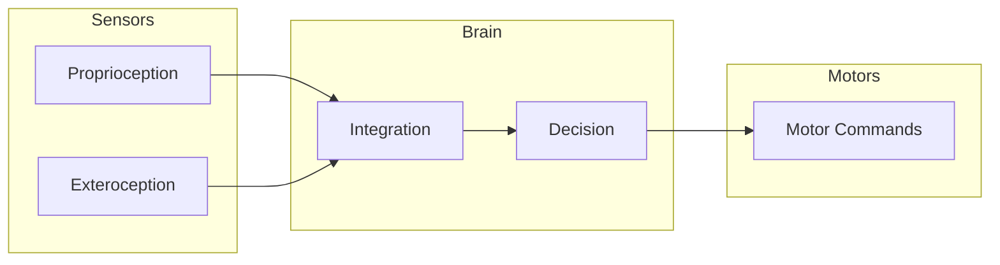
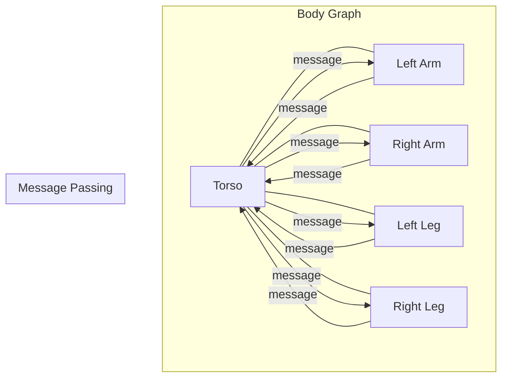
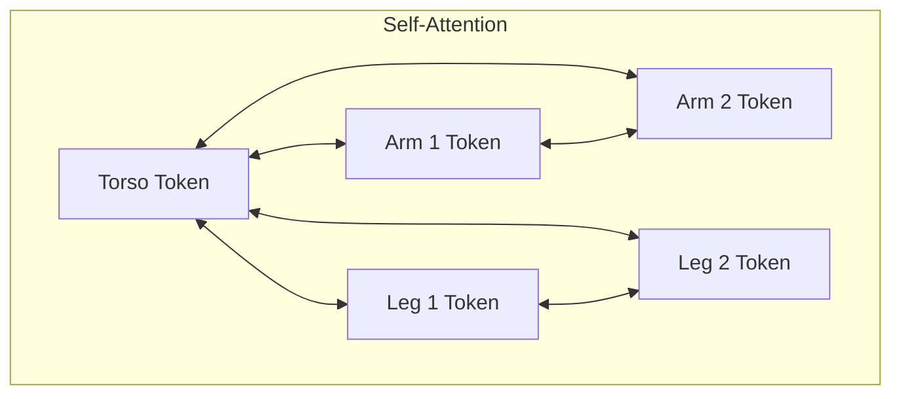
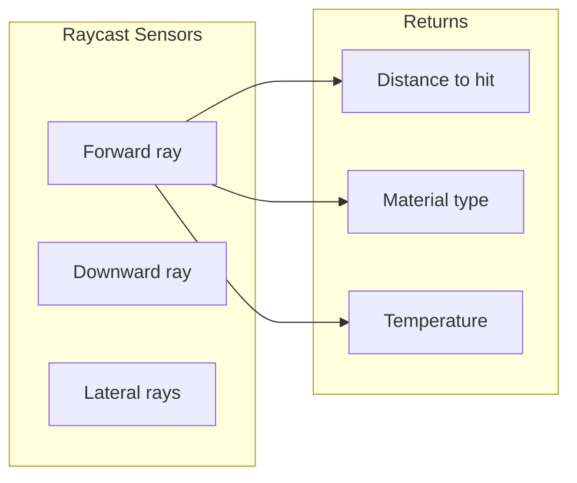
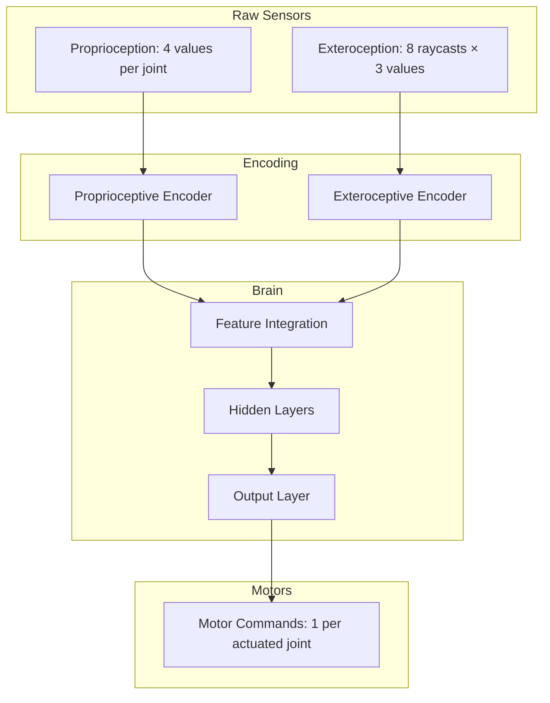
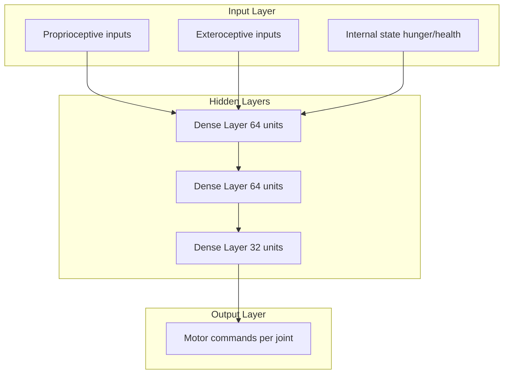
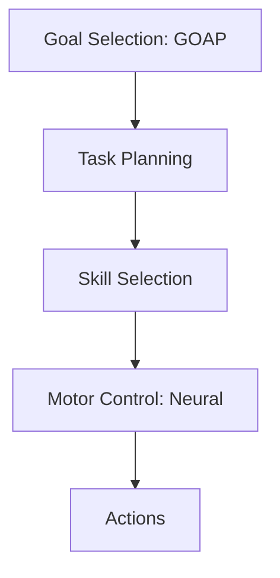

# Neural Control: Brain Architectures for Embodied Agents

Creatures in Sunaba need brains that can control their evolved bodies. This presents a unique challenge: the neural controller must work with any morphology that CPPN-NEAT produces.

## The Embodied Cognition Challenge

### Variable Morphology

Unlike traditional robotics where the body is fixed, evolved creatures have:
- Variable numbers of limbs
- Different joint configurations
- Varying sensor placements
- Diverse body proportions

A fixed-architecture neural network cannot handle this variability.

### Sensorimotor Coordination

The brain must:
1. **Sense** — Receive inputs from proprioceptive and exteroceptive sensors
2. **Process** — Integrate information into a coherent world model
3. **Act** — Generate coordinated motor commands



## Graph Neural Networks for Morphology

### The Key Insight

A creature's body can be represented as a graph:
- **Nodes** = Body segments
- **Edges** = Joints connecting segments

Graph Neural Networks (GNNs) naturally process graph-structured data, making them ideal for morphology-aware control.

### NerveNet Architecture

NerveNet (Wang et al., 2018) pioneered GNN-based control for articulated bodies:



### Message Passing

Each node computes messages to send to neighbors based on:
- Its own state (joint angles, velocities)
- The edge properties (joint type, limits)

```
m_ij = MLP_message(h_i, h_j, e_ij)
```

Nodes aggregate incoming messages:

```
h_i' = MLP_update(h_i, Σ_j m_ji)
```

After several message-passing rounds, each node has information about the global body state.

### Benefits of GNN Control

| Property | Benefit |
|----------|---------|
| Variable input size | Handles any number of limbs |
| Local computation | Scales linearly with body size |
| Permutation equivariance | Robust to limb ordering |
| Transfer learning | Policies can transfer between bodies |

## Transformer Architectures

### AMORPHEUS

AMORPHEUS (Gupta et al., 2021) applies transformer attention to morphology control:



### Attention Mechanism

Each body part attends to all other parts:

```
Attention(Q, K, V) = softmax(QK^T / √d) V
```

Where Q, K, V are projections of segment states.

### Positional Encoding for Bodies

Unlike sequences, bodies have graph structure. AMORPHEUS uses:
- **Proprioceptive encoding** — Joint angles and velocities
- **Morphological encoding** — Body part type, parent relationship
- **Spatial encoding** — Position relative to body center

## Sensor Systems

### Proprioception

Internal body sensing:

| Sensor | Information |
|--------|-------------|
| Joint angle | Current position of each joint |
| Joint velocity | Rate of change of joint angle |
| Joint torque | Force being applied by motor |
| Contact | Binary: is this part touching something? |

### Exteroception

External world sensing:



| Sensor | Information |
|--------|-------------|
| Raycasts | Distance/material in various directions |
| Ground detection | What's beneath each foot |
| Food detection | Nearby edible materials |
| Threat detection | Nearby predators/dangers |

### Sensor-Brain Pipeline



## Co-evolution of Body and Brain

### Why They Must Evolve Together

Bodies and brains are deeply coupled:
- A body optimized for a different brain won't function
- A brain optimized for a different body won't control well

### Developmental Coupling

In nature, bodies and nervous systems develop together. Nerves grow along with limbs. Sunaba mimics this:

1. CPPN-NEAT generates morphology
2. Body graph determines neural architecture
3. Neural weights are part of the genome
4. Both evolve together under selection

### The Baldwin Effect

An interesting phenomenon emerges:

1. Learning (neural adaptation) helps individuals survive
2. Individuals with better learning capacity are selected
3. Eventually, learned behaviors become "hardcoded"

This accelerates evolution by allowing beneficial behaviors to be discovered through learning before being genetically encoded.

## In Sunaba

### Deep Neural Controller

Sunaba uses a deep feedforward network with the following structure:



### Input Encoding

For each joint:
- Angle (normalized to [-1, 1])
- Angular velocity (normalized)
- Motor activation (previous frame)

Global inputs:
- Health level
- Hunger level
- Orientation (sin/cos of body angle)

### Output Decoding

Each output corresponds to a motor:
- Range: [-1, 1]
- -1 = maximum torque in negative direction
- 0 = no torque
- +1 = maximum torque in positive direction

### Activation Functions

- Hidden layers: ReLU (fast, avoids vanishing gradients)
- Output layer: Tanh (bounded motor commands)

### Weight Initialization

Weights are initialized using He initialization and then evolved. Initial random weights produce random behaviors, which MAP-Elites explores.

## Performance Considerations

### Inference Speed

With many creatures, neural inference becomes a bottleneck:

| Optimization | Impact |
|--------------|--------|
| SIMD operations | 2-4x speedup |
| Batch inference | Reduces per-creature overhead |
| Pruned networks | Smaller networks run faster |
| Fixed-point | Reduces memory bandwidth |

### Neural Stepping Frequency

Brains don't need to run every physics frame:
- Physics: 60 FPS
- Neural: 15-30 FPS (configurable)
- Motor commands interpolated between decisions

## Future Directions

### Hierarchical Control

Separating high-level goals from low-level motor control:



### Memory and Attention

Adding recurrent or transformer layers for:
- Remembering past observations
- Tracking moving prey/threats
- Planning multi-step sequences

### Meta-Learning

Training controllers that can quickly adapt to new bodies, enabling faster evolution of novel morphologies.

## References

- Wang, T., Liao, R., Ba, J., & Fidler, S. (2018). "NerveNet: Learning Structured Policy with Graph Neural Networks." *ICLR*.
- Huang, W., Mordatch, I., & Pathak, D. (2020). "One Policy to Control Them All: Shared Modular Policies for Agent-Agnostic Control." *ICML*.
- Gupta, A., Fan, L., Ganguli, S., & Fei-Fei, L. (2021). "MetaMorph: Learning Universal Controllers with Transformers." *ICLR*.
- Ha, D. (2019). "Reinforcement Learning for Improving Agent Design." *Artificial Life*.
- Heess, N., et al. (2017). "Emergence of Locomotion Behaviours in Rich Environments." *arXiv*.
