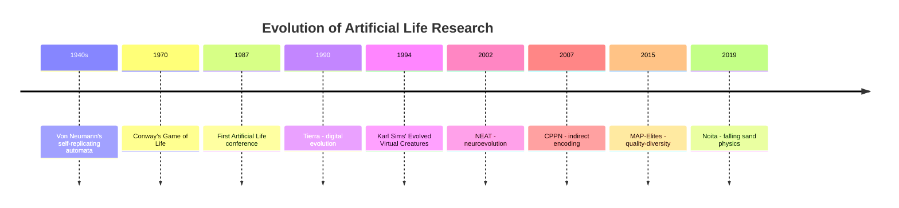
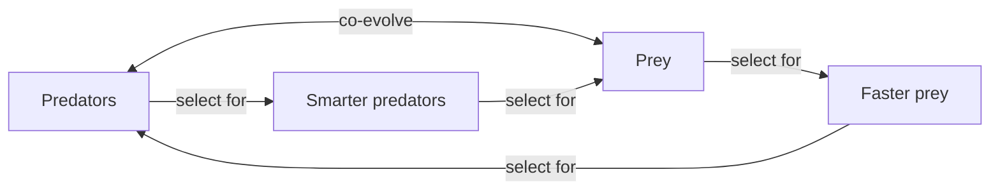
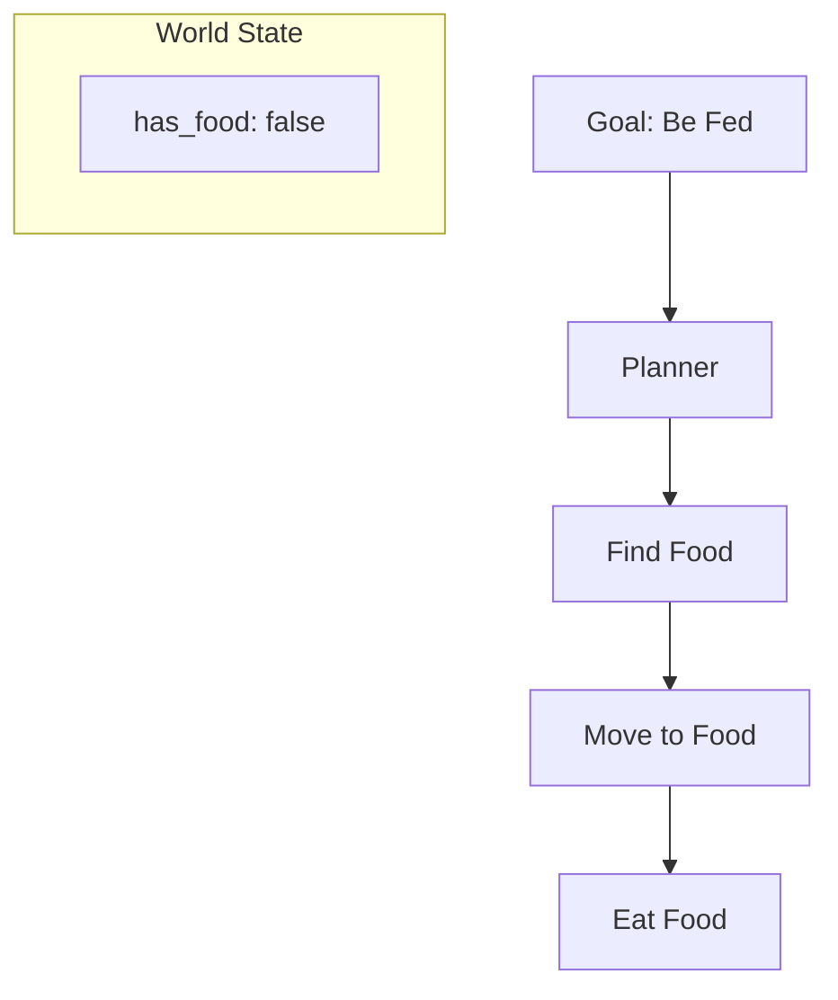

# Prior Work: Literature Review and Inspirations

Sunaba builds on decades of research across multiple fields. This page surveys the key works and ideas that inform the project.

## Artificial Life: A Brief History

### Von Neumann's Self-Replicating Automata (1940s)

John von Neumann asked: what are the logical requirements for a machine to reproduce itself? His cellular automaton model proved that self-replication was possible in a computational system, laying the groundwork for all artificial life research.

> "The question is whether it is possible to formulate the definition of life in a way that is both precise and inclusive."
> — John von Neumann

### Tierra (1990)

Thomas Ray created Tierra, a virtual world where self-replicating computer programs competed for CPU time and memory. Amazingly, evolution produced:
- Parasites (programs that hijack others' reproduction)
- Hyper-parasites (programs that exploit parasites)
- Social organisms (programs that cooperate)

No human designed these strategies—they emerged from evolutionary pressure.

### Karl Sims' Evolved Virtual Creatures (1994)

Karl Sims' seminal work demonstrated that complex, lifelike creatures could emerge from evolution:

- **Directed graphs** encoded creature morphology
- **Neural networks** controlled behavior
- Bodies and brains evolved together
- Creatures competed in virtual environments

The resulting creatures exhibited:
- Swimming behaviors
- Walking and running
- Following light sources
- Fighting over resources

This work directly inspired Sunaba's approach to creature evolution.

### Paper
Sims, K. (1994). "Evolving Virtual Creatures." *SIGGRAPH 94 Proceedings*.

## Falling Sand Games

### Origins

The falling sand genre emerged from early experiments with pixel-based physics:

**Falling Sand Game (2005)**
- Java applet
- Basic materials: sand, water, plant
- First viral falling sand game

**The Powder Toy (2009)**
- Open source
- Hundreds of materials
- Complex reactions (nuclear, electrical)
- Still actively developed

### Noita (2019)

Nolla Games' Noita represents the pinnacle of falling sand gaming:

**Technical Achievements:**
- Every pixel physically simulated
- Material reactions via lookup tables
- Parallel chunk processing
- Rigid body physics integration
- GPU-accelerated rendering

**Game Design:**
- Roguelike structure
- Magic wand crafting
- Physics-based puzzles
- Emergent combat strategies

Noita's GDC talk (2019) revealed many techniques Sunaba adopts:
- Checkerboard update patterns
- Temperature simulation
- Structural integrity systems
- Debris conversion to rigid bodies

## Neuroevolution

### NEAT (2002)

Stanley and Miikkulainen's NEAT (NeuroEvolution of Augmenting Topologies) solved the challenge of evolving neural network structure:

**Key Innovations:**
1. Historical markings enable crossover between different topologies
2. Speciation protects new innovations
3. Complexification from minimal structures

NEAT showed that evolving topology and weights together outperformed fixed-topology approaches.

### HyperNEAT (2007)

HyperNEAT extended NEAT using CPPNs as an indirect encoding:
- CPPN outputs connection weights
- Allows geometric regularities in weight patterns
- Scales to large networks

### ES-HyperNEAT (2012)

Evolution Strategies combined with HyperNEAT:
- CPPNs determine which connections exist
- Enables sparse, adaptive connectivity
- Better scaling to complex problems

## Quality-Diversity Evolution

### Novelty Search (2011)

Lehman and Stanley's Novelty Search abandoned fitness entirely:
- Only reward behavioral novelty
- Avoids deceptive fitness landscapes
- Discovers stepping stones to complex behaviors

### MAP-Elites (2015)

Mouret and Clune's MAP-Elites combined novelty and fitness:
- Maintain archive of diverse solutions
- Each solution is elite for its behavioral niche
- Illuminates the space of possible behaviors

### Applications to Robotics

Cully et al. (2015) used MAP-Elites for robot damage recovery:
- Pre-compute archive of walking behaviors
- When damaged, robot searches archive for working alternatives
- Recovery in under 2 minutes

This demonstrated QD's practical value for adaptive systems.

## Soft Body Evolution

### The Golem Project (2000)

Lipson and Pollack automatically designed and fabricated robots:
- Simulated evolution of body and brain
- Physical robots built from evolved designs
- Demonstrated simulation-to-reality transfer

### Voxel-Based Soft Robots

Recent work evolves soft robots from voxel grids:

**Cheney et al. (2013)**
- Evolved soft robots with multiple materials
- CPPN-generated morphologies
- Demonstrated complex locomotion

**Kriegman et al. (2020) — Xenobots**
- Evolved cell configurations
- Built from biological cells
- First living robots

## Multi-Agent Evolution

### Competitive Co-evolution

When agents evolve against each other:

Advantages:
- Open-ended complexity growth
- No fixed fitness function needed
- Arms races drive innovation

Challenges:
- Red Queen dynamics (running to stay in place)
- Loss of gradient (cycling behaviors)
- Forgetting old strategies

### POET (2019)

Wang et al.'s POET (Paired Open-Ended Trailblazer) co-evolves environments and agents:
- Environments become harder as agents improve
- Agents transfer between environments
- Produces generalist agents

### Intrinsic Motivation

Modern systems add internal drives:
- Curiosity (seek novel states)
- Empowerment (maximize influence on environment)
- Skill learning (acquire reusable behaviors)

## Physics Simulation

### Rapier2D

Sunaba uses Rapier for rigid body physics:
- Written in Rust
- Deterministic simulation
- Supports joints and motors
- Cross-platform (including WASM)

### Physics-Based Character Animation

The computer graphics community has developed techniques for physically simulated characters:

**DeepMimic (2018)**
- Neural networks learn from motion capture
- Physically simulated execution
- Robust to perturbations

**Character Controllers (Peng et al.)**
- Hierarchical policies
- Reusable skills library
- Transfer to new morphologies

## Behavioral AI

### GOAP (Goal-Oriented Action Planning)

GOAP separates what to do from how to do it:

Originally developed for F.E.A.R. (2005), GOAP enables:
- Emergent behavior sequences
- Dynamic replanning
- Readable AI logic

Sunaba plans to use GOAP for high-level creature decisions.

### Behavior Trees

An alternative to GOAP, behavior trees provide:
- Hierarchical behavior organization
- Priority-based selection
- Reactive responses

## Key Papers

### Foundational

- Von Neumann, J. (1966). *Theory of Self-Reproducing Automata*.
- Wolfram, S. (2002). *A New Kind of Science*.
- Ray, T. (1991). "An Approach to the Synthesis of Life." *Artificial Life II*.

### Evolution

- Stanley, K.O. & Miikkulainen, R. (2002). "Evolving Neural Networks through Augmenting Topologies."
- Stanley, K.O. (2007). "Compositional Pattern Producing Networks."
- Mouret, J.-B. & Clune, J. (2015). "Illuminating search spaces by mapping elites."

### Creatures

- Sims, K. (1994). "Evolving Virtual Creatures."
- Cheney, N., et al. (2013). "Unshackling Evolution."
- Wang, T., et al. (2018). "NerveNet."

### Games

- Nolla Games. (2019). "Exploring the Tech and Design of Noita." GDC.
- Orkin, J. (2006). "Three States and a Plan: The A.I. of F.E.A.R." GDC.

## Recommended Reading

For those wanting to dive deeper:

**Books:**
- Floreano, D. & Mattiussi, C. (2008). *Bio-Inspired Artificial Intelligence*.
- Stanley, K.O. & Lehman, J. (2015). *Why Greatness Cannot Be Planned*.
- Mitchell, M. (2009). *Complexity: A Guided Tour*.

**Survey Papers:**
- Pugh, J.K., et al. (2016). "Quality Diversity: A New Frontier."
- Doncieux, S., et al. (2015). "Evolutionary Robotics: What, Why, and Where to."
- Stanley, K.O., et al. (2019). "Designing Neural Networks through Neuroevolution."

**Video:**
- Karl Sims' "Evolved Virtual Creatures" (1994) — YouTube
- Noita GDC Talk (2019) — GDC Vault
- NEAT Explained — Various YouTube tutorials
